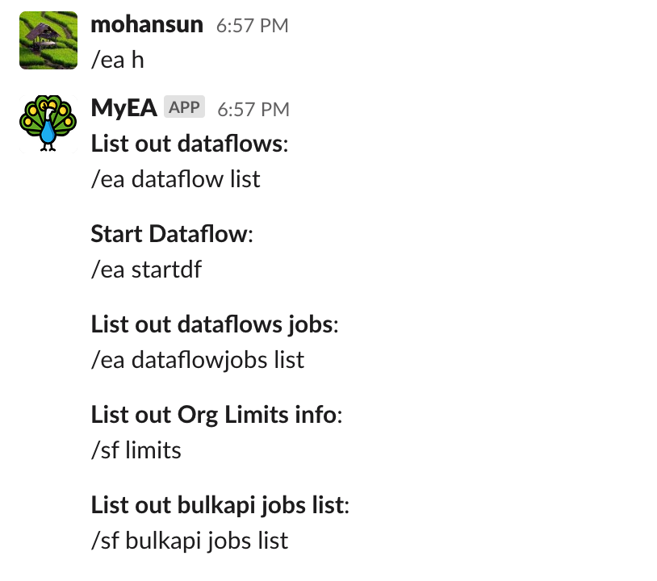
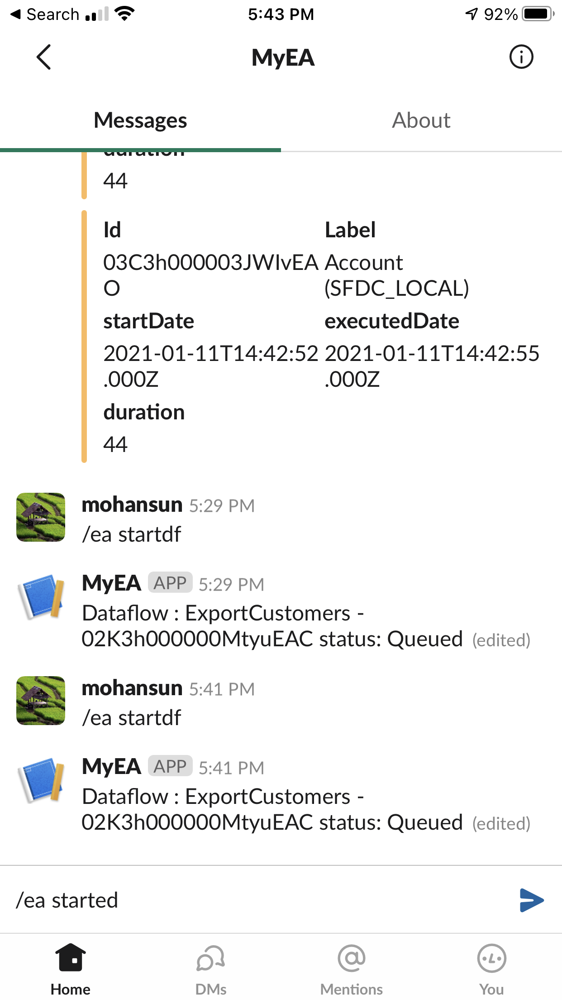
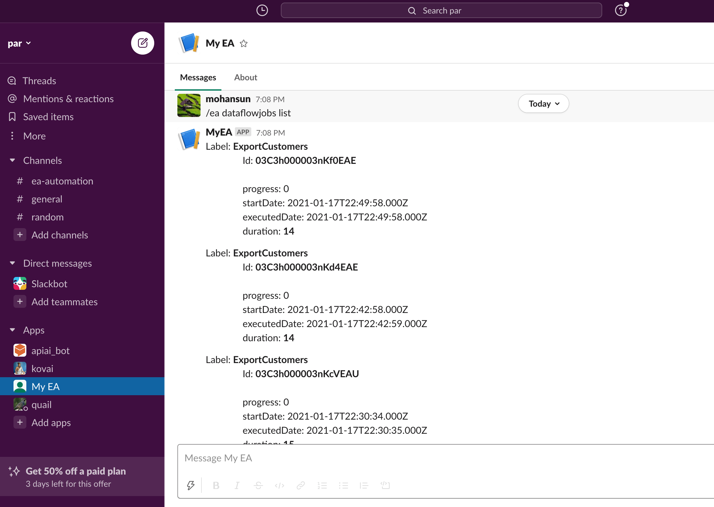
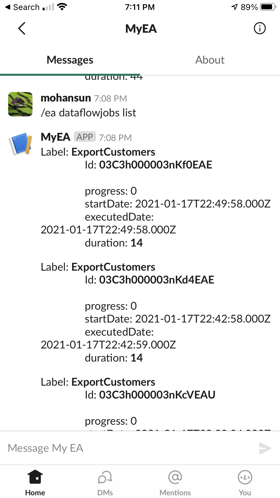
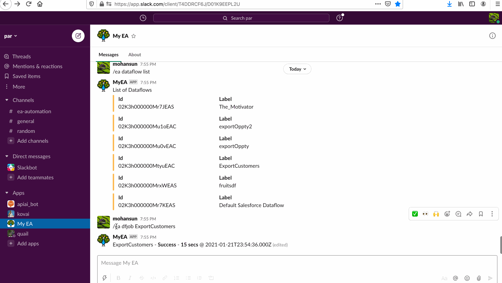

# Starting a dataflow job and monitor dataflow jobs using Slack 


## Topics
- [Setup](#setup)
- [Help](#help)


- [Desktop](#desktop)
    - [Demo 1](#demo1)
    - [Demo 2](#demo2)
    - [Demo 3](#demo3)


- [Mobile](#mobile)

- [Monitor](#monitor)
- [Dataflow job](#dfjob)

- [DX](#dx)


<a name="setup"></a>
## Setup
- [Url to start](https://mohansun-myea.herokuapp.com/add.html)
- https://mohansun-myea.herokuapp.com/add.html


<a name="help"></a>
## Help Command
</td>


<a name="desktop"></a>
<a name="demo1"></a>
## Demo 1 (desktop)


<a name="demo2"></a>
## Demo 2


<a name="demo3"></a>
## Demo 3


<a name="mobile"></a>
## Screenshots (Mobile)

<table>
<tr>
<td> </td>
<td></td>
<td></td>
</table>

<a name="monitor"></a>
## Monitor




<a name="dfjob"></a>
## Dataflow Job


<a name="dx"></a>
## Using DX
```
$ sfdx mohanc:ea:dataflow:list -u mohan.chinnappan.n_ea2@gmail.com
Id,Label
02K3h000000Mr7JEAS,The_Motivator
02K3h000000Mu1oEAC,exportOppty2
02K3h000000Mu0vEAC,exportOppty
02K3h000000MtyuEAC,ExportCustomers
02K3h000000MrxWEAS,fruitsdf
02K3h000000Mr7KEAS,Default Salesforce Dataflow

```

```
$ sfdx mohanc:ea:dataflow:start -u mohan.chinnappan.n_ea2@gmail.com -i 02K3h000000MtyuEAC
Dataflow Job Id: 02K3h000000MtyuEAC
{
  id: '0303h000002AYy9AAG',
  nodesUrl: '/services/data/v50.0/wave/dataflowjobs/0303h000002AYy9AAG/nodes',
  progress: 0,
  status: 'Queued',
  syncDataflows: { dataflows: [] },
  type: 'dataflowjob',
  url: '/services/data/v50.0/wave/dataflowjobs/0303h000002AYy9AAG'
}

```

## References
- [SalesforceBlogger: Start and stop dataflows on command](https://www.salesforceblogger.com/2021/01/19/start-and-stop-dataflows-on-command/)
- [SFDX plugin for Analytics](https://www.salesforceblogger.com/2020/11/17/mohans-sfdx-plugin-for-analytics/)
