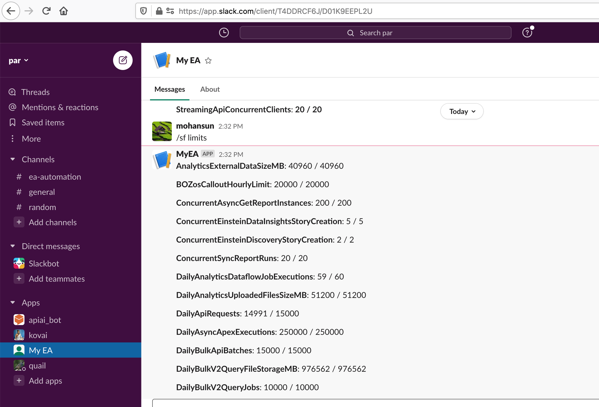
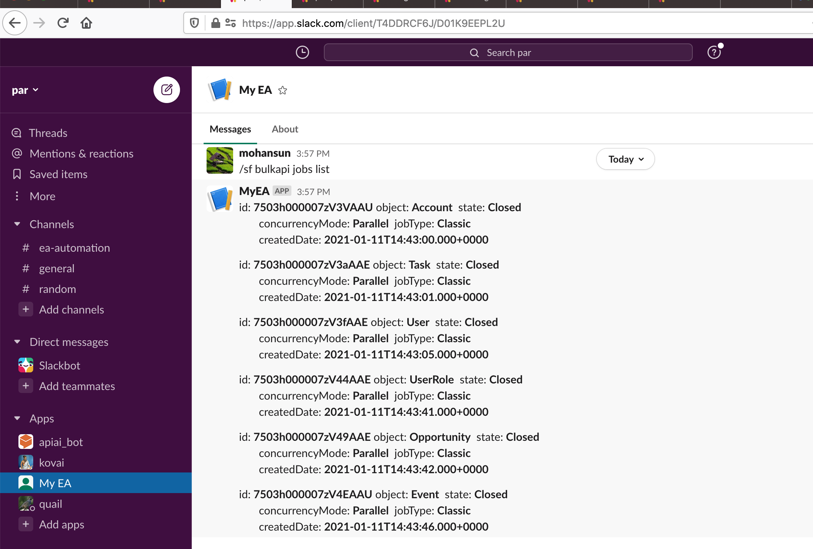

# SF related commands in Slack

## Topics
- [Limits](#limits)
- [BulkAPI Jobs](#bulkapijobs)
- [LImits via DX](#dx)


<a name='limits'></a>
## Org Limits


## Listing BulkAPI jobs 
<a name='bulkapijobs'></a>


<a name="dx"></a>
## Limits using DX
```
$ sfdx mohanc:ws:rest -f ~/.ea/header.json -r https://mohansun-ea-02-dev-ed.my.salesforce.com/services/data/v50.0/limits
{
    "AnalyticsExternalDataSizeMB": {
        "Max": 40960,
        "Remaining": 40960
    },
    "BOZosCalloutHourlyLimit": {
        "Max": 20000,
        "Remaining": 20000
    },
```
### Using Tooling api with DX
```
$ sfdx mohanc:tooling:execute -u mohan.chinnappan.n_ea2@gmail.com -a ~/.ea/mylimits.cls 
apexCode: 
Integer mygetLimitAggregateQueries = Limits.getLimitAggregateQueries(); System.debug('getLimitAggregateQueries: ' + mygetLimitAggregateQueries ); 
Integer mygetLimitAsyncCalls = Limits.getLimitAsyncCalls(); System.debug('getLimitAsyncCalls: ' + mygetLimitAsyncCalls ); 
Integer mygetLimitCallouts = Limits.getLimitCallouts(); System.debug('getLimitCallouts: ' + mygetLimitCallouts ); 
Integer mygetLimitCpuTime = Limits.getLimitCpuTime(); System.debug('getLimitCpuTime: ' + mygetLimitCpuTime ); 
Integer mygetLimitDMLRows = Limits.getLimitDMLRows(); System.debug('getLimitDMLRows: ' + mygetLimitDMLRows ); 
Integer mygetLimitDMLStatements = Limits.getLimitDMLStatements(); System.debug('getLimitDMLStatements: ' + mygetLimitDMLStatements ); 
Integer mygetLimitEmailInvocations = Limits.getLimitEmailInvocations(); System.debug('getLimitEmailInvocations: ' + mygetLimitEmailInvocations ); 
Integer mygetLimitFindSimilarCalls = Limits.getLimitFindSimilarCalls(); System.debug('getLimitFindSimilarCalls: ' + mygetLimitFindSimilarCalls ); 
Integer mygetLimitFutureCalls = Limits.getLimitFutureCalls(); System.debug('getLimitFutureCalls: ' + mygetLimitFutureCalls ); 
Integer mygetLimitHeapSize = Limits.getLimitHeapSize(); System.debug('getLimitHeapSize: ' + mygetLimitHeapSize ); 
Integer mygetLimitMobilePushApexCalls = Limits.getLimitMobilePushApexCalls(); System.debug('getLimitMobilePushApexCalls: ' + mygetLimitMobilePushApexCalls ); 
Integer mygetLimitPublishImmediateDML = Limits.getLimitPublishImmediateDML(); System.debug('getLimitPublishImmediateDML: ' + mygetLimitPublishImmediateDML ); 
Integer mygetLimitQueries = Limits.getLimitQueries(); System.debug('getLimitQueries: ' + mygetLimitQueries ); 
Integer mygetLimitQueryLocatorRows = Limits.getLimitQueryLocatorRows(); System.debug('getLimitQueryLocatorRows: ' + mygetLimitQueryLocatorRows ); 
Integer mygetLimitQueryRows = Limits.getLimitQueryRows(); System.debug('getLimitQueryRows: ' + mygetLimitQueryRows ); 
Integer mygetLimitQueueableJobs = Limits.getLimitQueueableJobs(); System.debug('getLimitQueueableJobs: ' + mygetLimitQueueableJobs ); 
Integer mygetLimitRunAs = Limits.getLimitRunAs(); System.debug('getLimitRunAs: ' + mygetLimitRunAs ); 
Integer mygetLimitSavepointRollbacks = Limits.getLimitSavepointRollbacks(); System.debug('getLimitSavepointRollbacks: ' + mygetLimitSavepointRollbacks ); 
Integer mygetLimitSavepoints = Limits.getLimitSavepoints(); System.debug('getLimitSavepoints: ' + mygetLimitSavepoints ); 
Integer mygetLimitSoslQueries = Limits.getLimitSoslQueries(); System.debug('getLimitSoslQueries: ' + mygetLimitSoslQueries ); 

compiled?: true
executed?: true
{
  line: -1,
  column: -1,
  compiled: true,
  success: true,
  compileProblem: null,
  exceptionStackTrace: null,
  exceptionMessage: null
}
```

