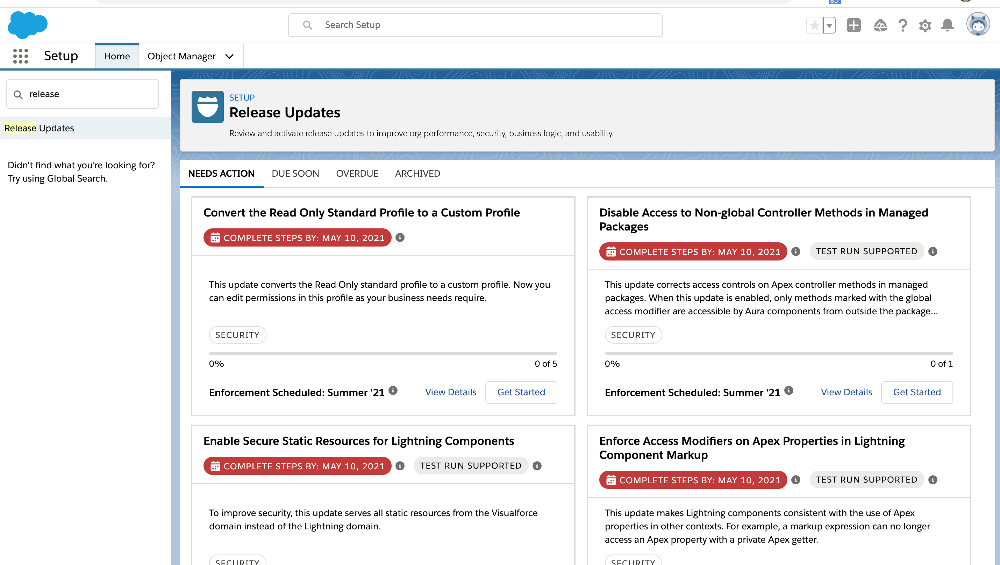
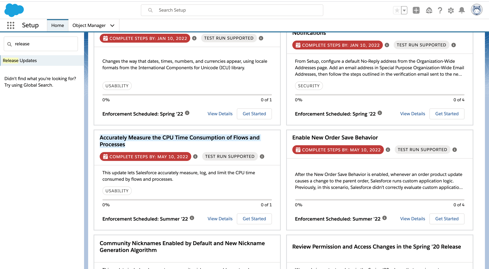
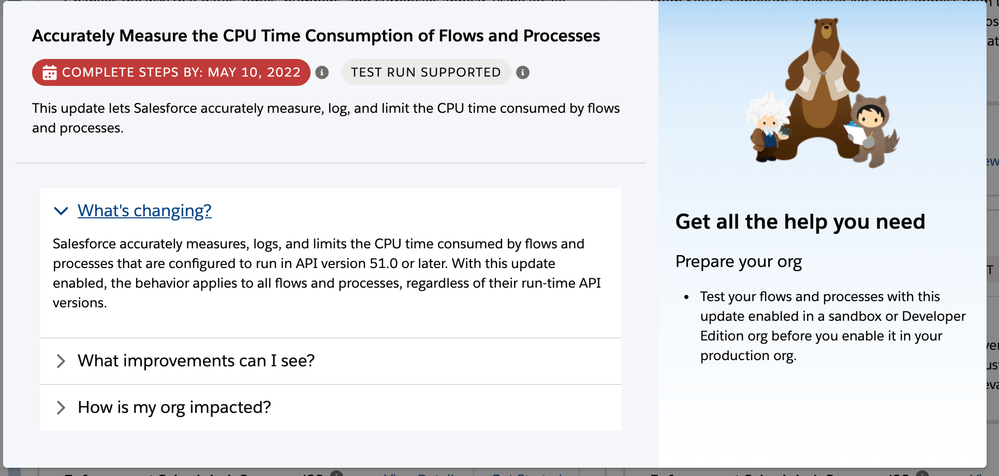

# Salesforce Flow

## Name changes
- Lightning Flow is now called Salesforce Flow
- Lightning Flow Builder and Lightning Process Builder are now called Flow Builder and Process Builder.

## Support for prior values for the triggering account
- Record-triggered flows can now access **prior values of the triggering record** and can run scheduled paths after the triggering event. 

## Flow Debugging

-  Many error emails now contain a link that opens Flow Builder, where you can see the interview’s path on the canvas and the error details. 
-  Debug schedule-triggered flows and autolaunched flows with no triggers directly on the canvas
- [Debug Failed Flows More Easily](https://help.salesforce.com/articleView?id=release-notes.rn_forcecom_flow_fbuilder_debug_email.htm&type=5&release=230)

## Enable Partial Save for Invocable Actions (Update, Enforced)

### Before
- If one invocable action fails, other invocable actions in the same transaction are rolled back. 
### Now
- Salesforce tries **three times** to execute the invocable actions that run successfully and rolls back only the invocable actions that fail to execute. This functionality is called **partial save**.
- [Release Notes](https://help.salesforce.com/articleView?id=release-notes.rn_forcecom_flow_release_update_partial_save.htm&type=5&release=230)

## Check for Null Record Variables or Null Values of Lookup Relationship Fields in Process and Flow Formulas (Update, Postponed)
- This update enables process and flow formulas to return null values when 
    - the calculations involve a null record variable or null lookup relationship field. 
- This update, released in Spring ’19, was scheduled for enforcement in Spring ’21, but was postponed to **Spring ’22**. 
- This update was enabled in Salesforce orgs that received Summer '20 before July 10, 2020. If this is true for your org and you disabled the update, you must enable it in Spring ’22.

### Example
- When you update an account, a process starts and checks the criteria before it performs actions. 
    - The criteria includes **a formula** that references the parent account’s name via the account’s **Parent Account field**. 
        - The Parent Account field is a lookup relationship field: [Account].Parent.Name.
    - If the value of the lookup relationship field is null, the formula returns null. 
    - Without this update, the formula **sometimes returns an unhandled exception instead of null**.

## Make Paused Flow Interviews Resume in the Same Context with the Same User Access (Previously Released Update)
- Paused autolaunched flows always resume in the same context and with the same user access they had before they were paused. 
- This update is enforced in Winter ‘22.
-  When an autolaunched flow resumes after a time-based resume event, the flow runs in **system context without sharing**. 
    - The flow resumes this way **regardless of the context and user access it had before it was paused**. 
    - With this update enabled, flows resume in the **same context and with the same permissions they had before they were paused**.

### Example
- Say that a user clicks a custom button to run an **autolaunched flow**, 
    -  that user doesn’t have permission to edit Record A. 
    - At first, the autolaunched flow runs in user context. 
        - But after it’s paused and resumed, the flow runs in system context and can edit Record A. 
- Enabling this update **prevents such flows from editing records that the running user doesn’t have permission to edit**.

- [Release notes](https://help.salesforce.com/articleView?id=release-notes.rn_forcecom_flow_release_update_resume_with_same_access.htm&type=5&release=230)

## Accurately Measure the CPU Time Consumption of Flows and Processes (Update)
### Before
- CPU time consumed was occasionally incorrect or misattributed to other automation occurring later in the transaction, such as Apex triggers
### Now
- Salesforce accurately measures, logs, and limits the CPU time consumed by all flows and processes. 
- Now you can properly identify performance bottlenecks that cause the maximum per-transaction CPU time consumption limit to be exceeded. 
    - Because CPU time is now accurately counted, flows and processes fail after executing the element, criteria node, or action that pushes a transaction over the CPU limit.

### TODO
- We recommend testing all complex flows and processes, which are more likely to exceed this limit.
- Flows and processes fail if they cause a transaction to exceed the CPU time limit, and complex flows and processes are more likely to exceed this limit. 
- To **decrease the CPU time usage** of a flow or process, 
    - reduce the number of elements, formulas, and cross-object references. 
    - You can check the debug logs to see how much CPU time is taken by each element, criteria node, and action.
### Apply

