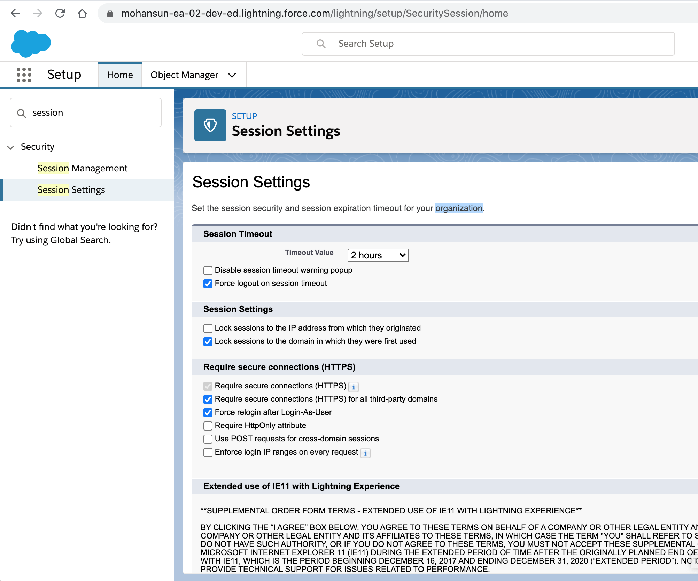

# Session Timeout

## Org level

## Profile Level
- Profile level session settings overrides the organization-wide Timeout value for users of that profile. 
- Your changes to the organization-wide Timeout value will not apply to users of a profile with its own Session Timeout value.

## References
- [Session Security](https://help.salesforce.com/articleView?id=security_overview_sessions.htm&type=5)
- [Edit Session Settings in Profiles](https://help.salesforce.com/articleView?id=users_profiles_session.htm&type=5)
