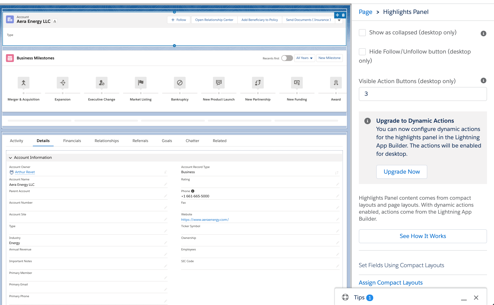

# Spring 21 Release

## Topics
- [Showing Custom Actions button in the **Recently Viewed List**](#customactions)
- [Share Records with Manual Sharing](#manualsharing)
- [Field-Level Help Text limit: 255 to 510 chars](#fhelplimit)
- [Catch Potential Duplicates Before Saving](#dupcatch)
- [Dynamic actions](#dynaactions)
- [Page performance analyze](#pageperf)
- [In-App-guidance](#iag)

### Pre Spring 21

### Spring 21

 

### References
- [Power Up Recently Viewed Lists with Customizable Actions](https://help.salesforce.com/articleView?id=release-notes.rn_lex_mru_list_actions.htm&type=5&release=230)

## Share Records with Manual Sharing 
- Now you can share records and manage record shares in a new streamlined interface.
    - Previously, you need to switch to Salesforce Classic to give specific users and user groups access to records.

### Pre Spring 21
 

### Spring 21
 
 

## Field-Level Help Text limit: 255 to 510 chars

### References
[Define Field-Level Help](https://help.salesforce.com/articleView?id=customhelp_defining_field_level_help.htm&type=5)

## Catch Potential Duplicates Before Saving

- Custom Objects for now

### References
- [Catch Potential Duplicates Before Saving](https://help.salesforce.com/articleView?id=release-notes.rn_lex_duplicates.htm&type=5&release=230)
- [Dynamic Forms](https://help.salesforce.com/articleView?id=dynamic_forms_migrate.htm&type=5)

## Dynamic Actions - How Salesforce Administrators Can Easily Control Visibility of Actions
- Beta to GA

### References
- [Salesforce Dynamic Actions - How Salesforce Administrators Can Easily Control Visibility of Actions](https://www.youtube.com/watch?v=AE1J5JSdpdc&list=PLrC_ei2_Pv0Gb-uuA5UxFneaVSjkCepYQ)

## Page Performance analyze

## In-App-Guidance

## Links
-  Spring21 Release Webinar for Enterprise Customers [SP]
    - [Video](https://salesforce.vidyard.com/watch/Bb5KtxUUvvm5xfdpThuxHG)
    - [Slides]( https://sfdc.co/cdXukP)
 
